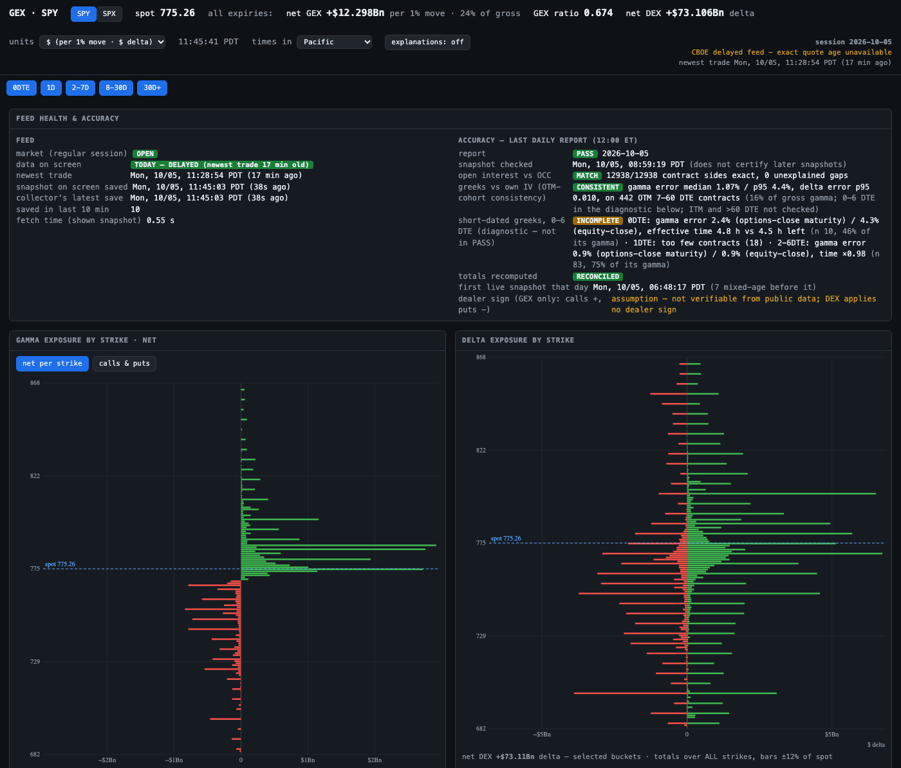
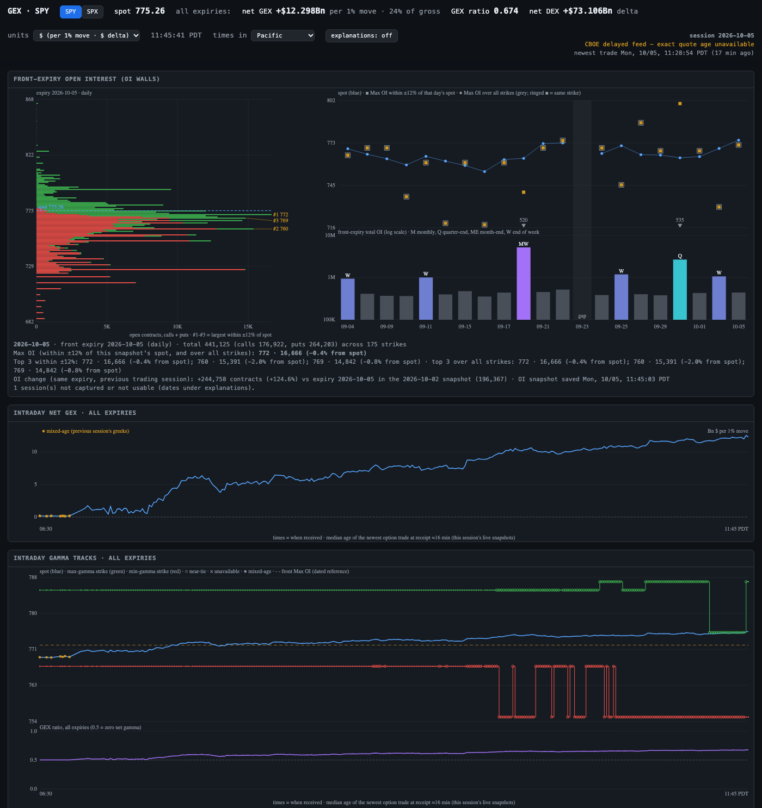
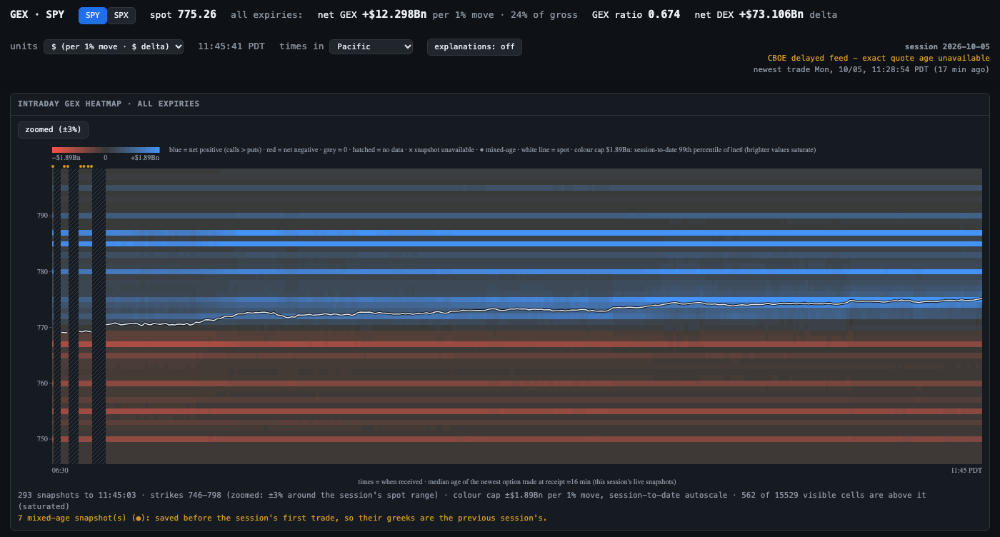
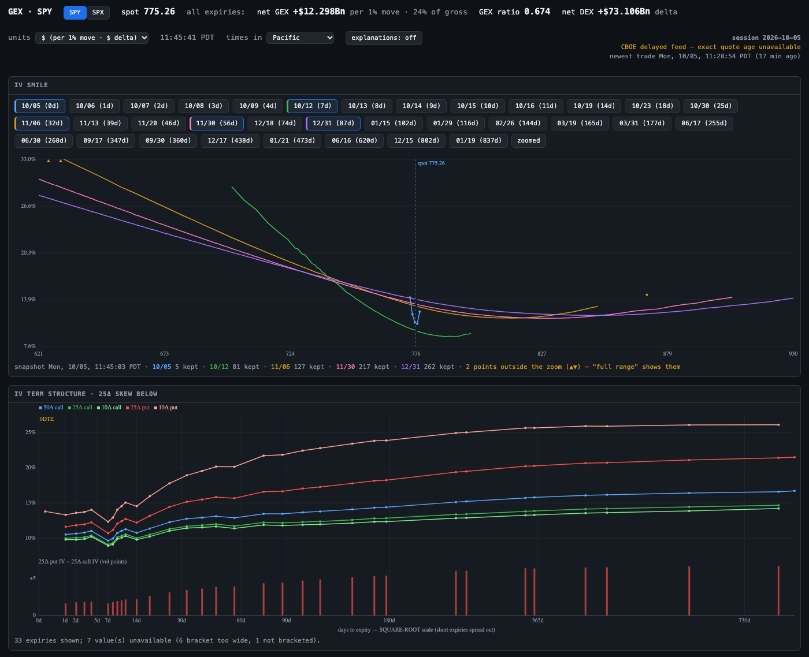

# GEX Dashboard

A self-hosted options-exposure dashboard for SPY and SPX: a collector that
polls the full option chain about once a minute through the trading session
and keeps every usable, changed snapshot as per-strike aggregates (plus one
raw checkpoint a day); a validated Parquet store; and a single-page dashboard
that turns each snapshot (~13,000 SPY or ~29,000 SPX contracts) into
dealer-gamma (GEX), delta (DEX), open-interest and implied-volatility views.



It is a **viewer, not a trading signal.** Gamma exposure was tested as a
predictive signal in several forms before this tool was built, and it failed
every time. What this project optimises for instead is *trustworthy numbers*:
everything on the page is computed from stored snapshots, and the pipeline is
checked daily against an outside source and by independent recomputation
(scopes below).

## What it shows

| Panel | What it is |
|---|---|
| GEX / DEX by strike | Gamma and delta exposure per strike, calls and puts or netted, filterable by expiry bucket (0DTE, 1D, 2-7D, 8-30D, 30D+) |
| Open interest and volume by strike | With put/call ratios over all strikes |
| Front-expiry OI walls | Max-OI strikes on the nearest expiry, plus a by-session history, coloured by expiry kind (monthly, quarter-end, ...) |
| Intraday net GEX | The session's trend, one point per stored snapshot |
| Gamma tracks | The max- and min-net-gamma strikes through the session, with the GEX ratio below |
| Intraday GEX heatmap | Net gamma per strike × time, on a colour-blind-safe blue/red ramp |
| IV smile | Model IV by strike per expiry, out-of-the-money side, quote-quality filtered |
| IV term structure | IV at fixed deltas (ATM = 50Δ call, plus 25Δ and 10Δ calls and puts) across expiries, with the 25Δ skew |
| Feed health and accuracy | What the snapshot on screen is, how old its newest trade is, and the latest daily accuracy report |





## Architecture

```
          every 60 s in session                 one process, one bundle per symbol
 Cboe ─► collector ─► store (Parquet) ─────────► dashboard server ─► browser
         (fetch,       metadata  (1 row/poll)    (reads the store;    (vanilla JS,
          validate,    aggregates (per strike,     never contacts      canvas charts,
          aggregate)     expiry, root)             the source)         SSE push)
                       raw checkpoint (daily)
                                ▲
          daily 12:00 ET        │
 OCC ──► validator ─────────────┘  writes a JSON accuracy report per session
```

- **Collector** (`gex/collector.py`, `gex/fetch.py`, `gex/aggregate.py`): a
  session-aware poller (exchange holidays and early closes included) that
  aggregates each payload in one pass with no pandas in the hot path: a
  ~13 MB, ~29,000-contract SPX chain becomes per-strike rows in about a tenth
  of a second.
- **Store** (`gex/store.py`): three layers (per-poll metadata, per-strike
  aggregates, one raw checkpoint a day), Parquet + Zstd, partitioned by symbol
  and date, written atomically (temp file, fsync, rename).
- **Dashboard** (`gex/server.py`, `web/`): a stdlib HTTP server that only
  reads the store, so viewers never add load on the data source. It pushes
  new snapshots over Server-Sent Events, and the page draws everything on
  canvas.
- **Validator** (`gex/validate.py`): a daily accuracy report (below).
- **Deployment** (`scripts/*.service`): systemd units on a small cloud VM
  (Ubuntu, ARM); the dashboard binds to localhost and is reached over an SSH
  tunnel.

## How accuracy is checked

Data that cannot be re-downloaded has to be right the first time, so the
checks are part of the system. A daily report (noon ET) takes **one live SPY
snapshot per session** and checks it three ways. It certifies that snapshot,
not every snapshot in the archive, and SPX coverage is on the roadmap.

- **Open interest vs OCC.** Every contract side of the snapshot is compared
  with the Options Clearing Corporation's published open interest; the usual
  result is an exact match on every side (e.g. 12,980 of 12,980).
- **Greeks vs their own IV.** Gamma and delta are recomputed with
  Black-Scholes-Merton from the source's implied volatility on a clean
  7-60 DTE cohort; the median gamma error is typically 1-2%. This is a
  consistency check against the source's own model inputs, not an
  independent price source. Short-dated contracts get a separate,
  report-only diagnostic.
- **Arithmetic.** The snapshot's stored totals (net GEX and DEX) are
  recomputed independently from its stored rows.
- **A one-off audit** (before SPX support) recomputed every number on the
  page from raw payloads with separate code: three snapshots, every IV-smile
  point and the OI history all matched.
- **Tests that are known to bite.** 14 suites, most run against archived
  market data. The important ones are mutation-verified: deliberately
  breaking the code (a wrong key, an off-by-one window, a skipped filter)
  has to make them fail, and it does.


## Limits

- The source is a **delayed** feed (~16 minutes). This is a low-latency
  *display* of delayed data, never "real-time".
- **Open interest updates once a day.** Intraday GEX changes are mostly
  revaluation (spot, IV, time), not observed position changes.
- **Dealer positioning is an assumption.** "Calls +, puts −" is an industry
  convention; public data cannot show who holds which side. The page says so.
- Net GEX is a difference of two large sums, so it is sensitive to small
  model differences; the per-strike profile is the more robust view.


## Running it

Python 3.10+ with `requests` and `pyarrow` (`requirements.txt`).

Each command below is a long-running process; run them in separate
terminals (or as services).

```bash
python3 -m venv .venv && .venv/bin/pip install -r requirements.txt

# one collector per symbol (session-aware; idles outside market hours)
.venv/bin/python -m gex.collector --symbol SPY --root data
.venv/bin/python -m gex.collector --symbol _SPX --root data

# the dashboard for the symbols you collect -> http://127.0.0.1:8788
.venv/bin/python -m gex.server --symbol SPY --symbol SPX --data-root data

# the daily accuracy report (SPY), normally run by a timer
.venv/bin/python -m gex.validate --symbol SPY --root data
```

`scripts/*.service` are systemd unit **templates** (collector per symbol,
dashboard, daily validation timer); edit the user and paths
(`/home/ubuntu/gex_tool`, `/home/ubuntu/gex_data`) for your host, and create
the data directory first (systemd opens the log files there). The
dashboard binds to localhost; reach it with
`ssh -N -L 8788:127.0.0.1:8788 <host>`.

## Tests

```bash
.venv/bin/python tests/test_market_calendar.py
.venv/bin/python tests/test_collector_backoff.py
.venv/bin/python tests/test_checkpoint_atomic.py
```

Those three run standalone. The others exercise the real pipeline against
an archive of collected snapshots and SPX chains that is not distributed (per
the data terms above), and a few compare against earlier versions of the code
from the original private repository's history, which is not included here.
Treat them as the project's own evidence rather than something reproducible
from this repository alone.

